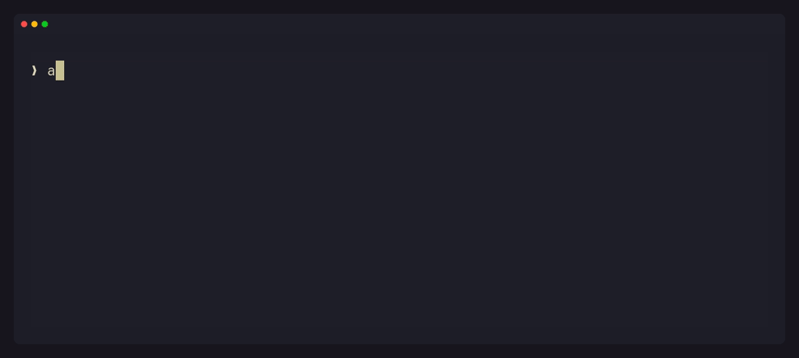

  

Software Engineering student at Hochschule Esslingen, 4th semester.
Java and Spring Boot as the foundation, Go as the thing I'm learning properly right now.

**Looking for an internship or working student position in the Stuttgart area from WS26.**

 

## Projects

### [VentoryGo](https://github.com/Mirac61/Invoice) — Invoice backend in Go

  
  
  
  

- `pgx` instead of an ORM, migrations via `golang-migrate`
- Money as `int64` cents, VAT rates as integer basis points — no floats near the money logic
- Cancellations through credit notes rather than deletions, so the document chain stays intact

### [mysh](https://github.com/Mirac61/mysh) — Unix shell in C++

  
  

- Straight against the syscalls — `fork()`, `exec()`, `pipe()`, `dup2()`
- Pipes, redirects, signal handling, tab completion, git integration
- ~9ms cold start, no memory leaks under Valgrind

 

## Stack

  
  
  
  
  

  
  
  
  
  

  
  
  
  

 

## Stats

  
  

 

## Connect

  

