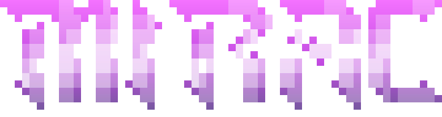

  

Software engineering student at Hochschule Esslingen, 5th semester. I mostly write
backend services in Go and Java/Spring Boot, and I gravitate towards the parts where
being wrong is expensive: money, state, things you can't quietly get wrong.

**Suche eine Werkstudentenstelle (20 h/Woche) im Raum Stuttgart, idealerweise mit der Option, dort ab Sommersemester 2027 auch das Pflichtpraktikum (ca. 5 Monate) zu absolvieren.**

## Projects

**[VentoryGo](https://github.com/Mirac61/VentoryGo)** | invoicing backend · Go, Gin, PostgreSQL, Docker

Invoicing service for small businesses. Amounts are stored as `int64` cents and VAT
as basis points, so no float ever touches the money, and invoices are never deleted —
a cancellation writes a credit note, which keeps the books auditable. The document
model leaves room for ZUGFeRD/XRechnung output. Sessions use Argon2id with rate
limiting on the auth endpoints; PDFs are generated server-side.
Unit tests cover the money paths: rounding, VAT calculation, credit notes.

**[Aktivitätstracker](https://github.com/Mirac61/activitytracker)** | Android client and Spring Boot backend · Kotlin, Java, Keycloak

Team project for 5 people over one semester. Offline-first: the client writes
locally and reconciles through WorkManager, so the app stays usable without network.
Auth via Keycloak, CI builds and signs release APKs on tag. I worked on the offline sync between the local and remote database, the statistics feature, and the release pipeline.

**[mysh](https://github.com/Mirac61/mysh)**  | Unix shell · C++

Interactive shell built directly on `fork()`, `exec()`, `pipe()` and `dup2()`.
Pipelines, redirections, signal handling, tab completion. No leaks reported under Valgrind.

## Stack

    Almost daily:
  
  
  
  
  

    Used in projects:
  
  
  
  
  
  

## Contact

  
  <a href="https://www.linkedin.com/in/mirac-sancak-47917238b/">

